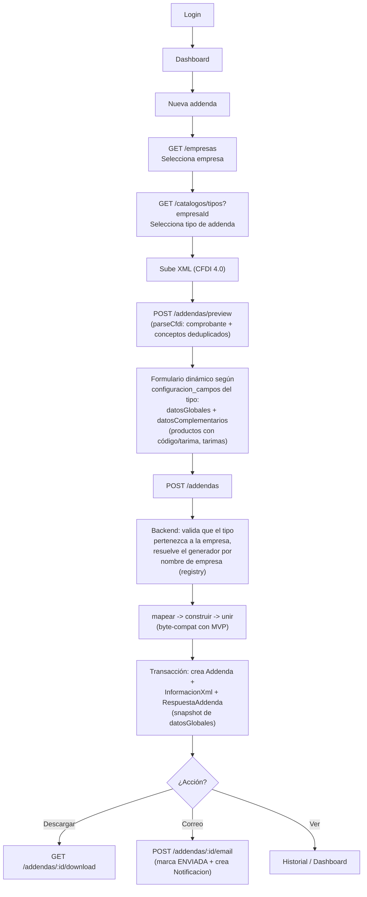
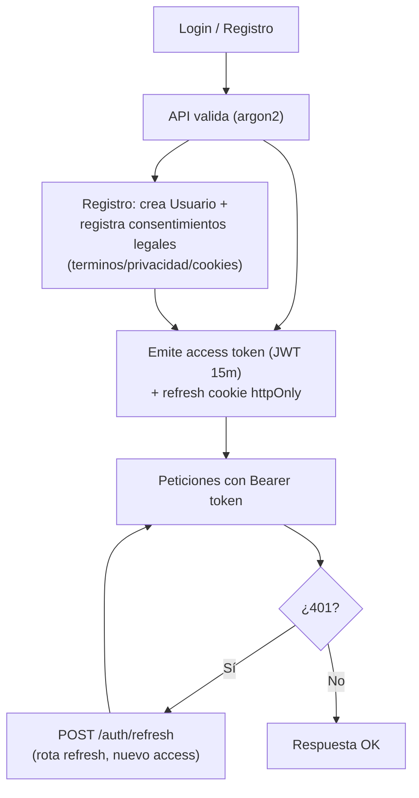
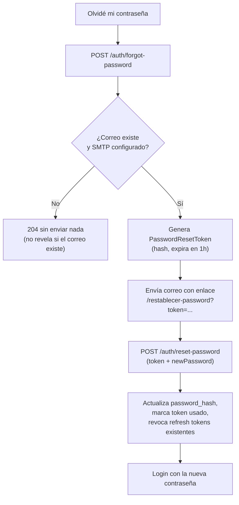

# Diagrama de flujo

## Flujo de generación de una addenda

```mermaid
flowchart TD
  A["Login"] --> B["Dashboard"]
  B --> C["Nueva addenda"]
  C --> D["GET /empresas\nSelecciona empresa"]
  D --> E["GET /catalogos/tipos?empresaId\nSelecciona tipo de addenda"]
  E --> F["Sube XML (CFDI 4.0)"]
  F --> G["POST /addendas/preview\n(parseCfdi: comprobante + conceptos deduplicados)"]
  G --> H["Formulario dinámico según\nconfiguracion_campos del tipo:\ndatosGlobales + datosComplementarios\n(productos con código/tarima, tarimas)"]
  H --> I["POST /addendas"]
  I --> J["Backend: valida que el tipo\npertenezca a la empresa,\nresuelve el generador por\nnombre de empresa (registry)"]
  J --> K["mapear -> construir -> unir\n(byte-compat con MVP)"]
  K --> L["Transacción: crea Addenda +\nInformacionXml + RespuestaAddenda\n(snapshot de datosGlobales)"]
  L --> M{"¿Acción?"}
  M -->|Descargar| N["GET /addendas/:id/download"]
  M -->|Correo| O["POST /addendas/:id/email\n(marca ENVIADA + crea Notificacion)"]
  M -->|Ver| P["Historial / Dashboard"]
```

## Flujo de autenticación

```mermaid
flowchart TD
  A["Login / Registro"] --> B["API valida (argon2)"]
  B --> C["Registro: crea Usuario +\nregistra consentimientos legales\n(terminos/privacidad/cookies)"]
  B --> D["Emite access token (JWT 15m)\n+ refresh cookie httpOnly"]
  C --> D
  D --> E["Peticiones con Bearer token"]
  E --> F{"¿401?"}
  F -->|Sí| G["POST /auth/refresh\n(rota refresh, nuevo access)"]
  G --> E
  F -->|No| H["Respuesta OK"]
```

## Flujo de recuperación de contraseña

```mermaid
flowchart TD
  A["Olvidé mi contraseña"] --> B["POST /auth/forgot-password"]
  B --> C{"¿Correo existe\ny SMTP configurado?"}
  C -->|No| D["204 sin enviar nada\n(no revela si el correo existe)"]
  C -->|Sí| E["Genera PasswordResetToken\n(hash, expira en 1h)"]
  E --> F["Envía correo con enlace\n/restablecer-password?token=..."]
  F --> G["POST /auth/reset-password\n(token + newPassword)"]
  G --> H["Actualiza password_hash,\nmarca token usado,\nrevoca refresh tokens existentes"]
  H --> I["Login con la nueva contraseña"]
```
